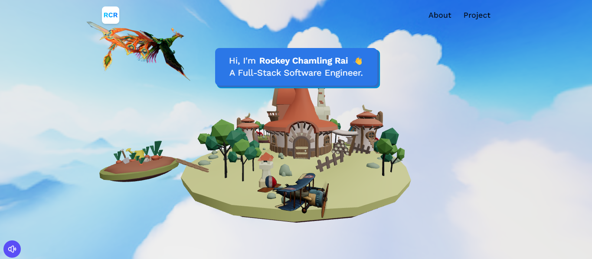
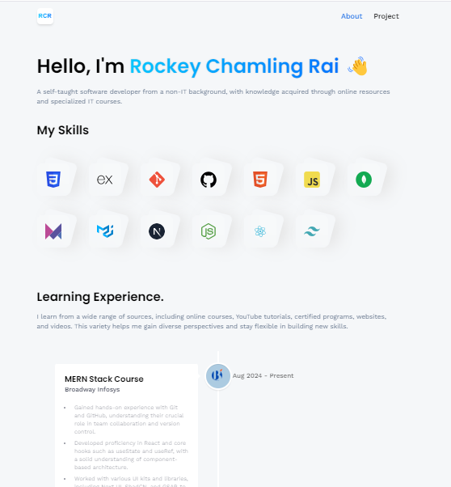
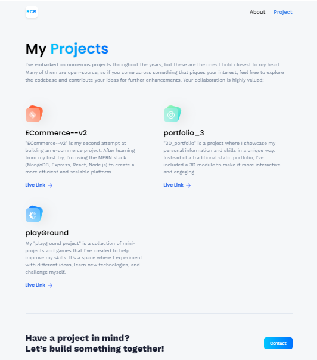
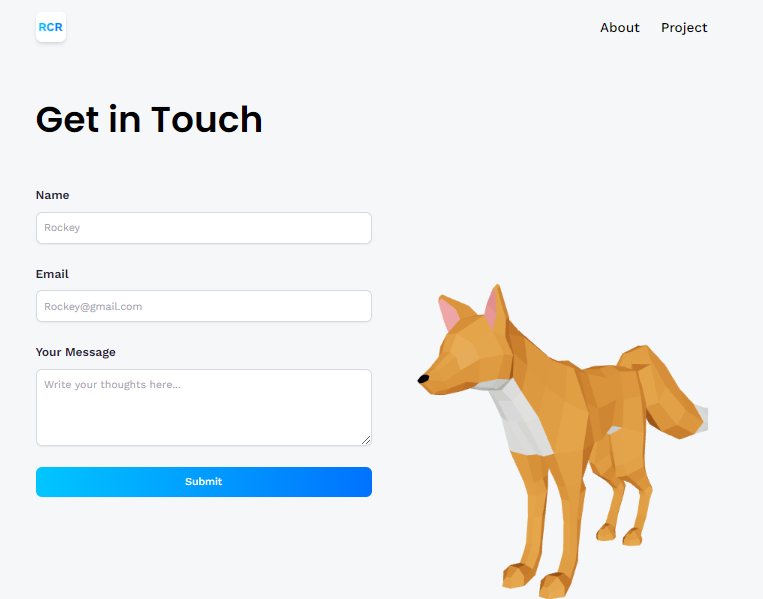

# 🌌 portfolio_3

### **Description**
This is my third attempt at creating a personal portfolio, and it features an immersive 3D experience with models like a bird, island, fox, and plane. It's also my first project working with 3D modules. I learned the techniques from JavaScript Mastery tutorials.

### **Features**
- 🎵 **Music Button**: A button at the bottom-left corner to play and stop background music.
- 🌎 **Interactive 3D Island**: Rotate the island model using the mouse or arrow keys (left and right).
- 🦊 **Animated Fox on Contact Page**: The fox model moves in response to focus events on the contact form.
- 📧 **Email Functionality**: Messages sent from the contact form are delivered to my email using `@emailjs/browser`.
- 🪧 **Interactive Popups**: Popups at certain points invite visitors to explore various sections of the page.

---

### **Image & Demo**


<p align ="center">




</p>


<video src="public/video/video1.mp4" controls width="100%"></video>
<video src="public/video/video2.mp4" controls width="100%"></video>
<video src="public/video/video3.mp4" controls width="100%"></video>

### **Technologies Used**

**Languages:**  
- **JavaScript** - Primary programming language used for functionality.

**Libraries and Frameworks:**
- used for building fast and optimized web applications.
``` bash
  npm create vite@latest
  ```
- Enables the integration of Three.js into React for creating 3D graphics.
``` bash
npm @react-three/fiber
```
- Provides useful helpers and abstractions for Three.js.
``` bash
npm @react-three/drei
```
- A spring-physics-based animation library for Three.js.
``` bash
npm @react-spring/three
```
- Manages routing between different pages within the application.
``` bash
npm react-router-dom
```
- Used to send emails directly from the browser, which powers the contact form.
``` bash
npm @emailjs/browser
```
- Creates a visually appealing vertical timeline component.
``` bash
npm react-vertical-timeline-component
```

**3D Models:**
- **Sketchfab** - Source for 3D models.
- **GLTF-PMND** - A site for converting 3D models into usable code for React. [Convert your models here](https://gltf.pmnd.rs/).

---

### **Installation Instructions**

To run this project locally, follow these steps:

```bash
# Clone the repository
git clone https://github.com/rockeyrai/portfolio_3

# Navigate to the project directory
cd portfolio_3

# Install dependencies
npm install

# Start the development server
npm start
